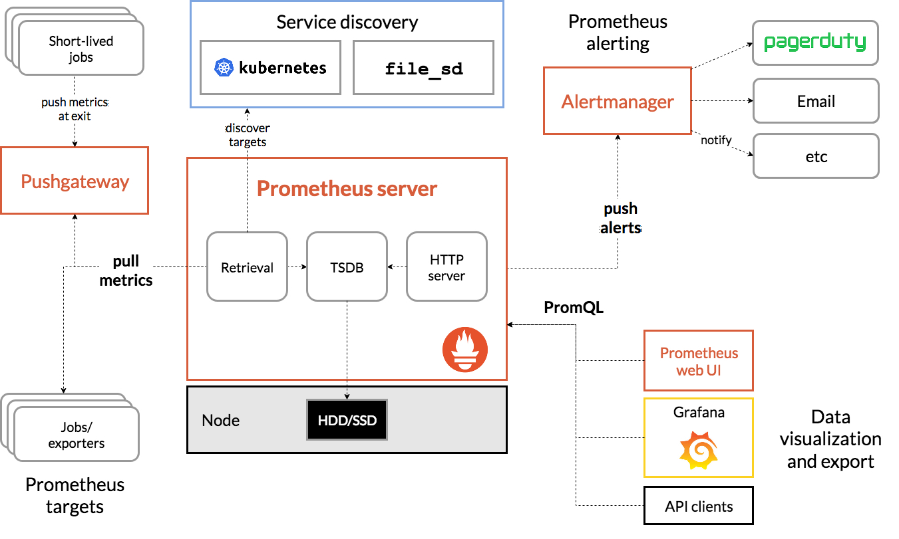

# Prometheus

Prometheus 是一個開源系統監控和警示的工具包。

Prometheus 在 2016 加入 Cloud Native Computing Foundation，成為其第二個託管的專案。

## 目錄

- [架構](#架構)
- [詞彙解釋](./doc/glossary.md)
- [Prometheus](./doc/prometheus)
    - [Server](./doc/prometheus/server)
    - [Alertmanager](./doc/prometheus/alertmanager)
- [Exporters](https://github.com/48763/prom-client-ex)
- [Grafana](./doc/grafana)

## 前言

Prometheus 相關的服務啟用與配置，路徑都與服務名稱相對應：

```bash
$ git clone https://github.com/48763/prometheus-monitor.git
$ cd prometheus-monitor/deploy
$ tree
.
├── grafana
├── nginx
└── prometheus
    ├── alertmanager
    └── server
```

## 架構



Prometheus 服務器，可以從 *Pushgateway* 或目標的 *exporter* 拉取（pull）測量指標；而對於目標本身，只需透過 *exporter* 將指標曝露給外部服務器，或是將指標推送（push）到 *Pushgateway*，使其收集，並讓服務器拉取。

服務器會將收集的測量指標與時間序列，透過 *預寫式日誌（WAL, write-ahead-log）* 的方式，先保存在記憶體當中，而不會立即寫入到資料庫（levelDB）。預寫式日誌以 128MB 為一個分段，儲存在目錄 `wal` 下。預寫的檔案會以兩個小時一次，壓縮寫至到資料庫（TSDB）內。

觀看所儲存的測量指標數據時，可以透過 Prometheus 的原生介面，以 PromQL（Prometheus Query Language）查詢想要的資訊，系統並會呈現數據或圖形量表；或者是用第三方應用 - *Grafana*
，將 prometheus 的資料來源加入，就可以隨意製作儀表板的呈現方式，以方便觀測目標主機的狀態。

另外，可以服務器上設置跳警規則，使其在抓取指標時，會判斷其數據是否需要跳警，而跳警的訊息會推送至 *Altermanager*。Altermanager 負責處理跳警事件，以及事件的持續追蹤，其警告資訊，可以推送至社群平台（e.g. slack），以方便人員接收並處理。
