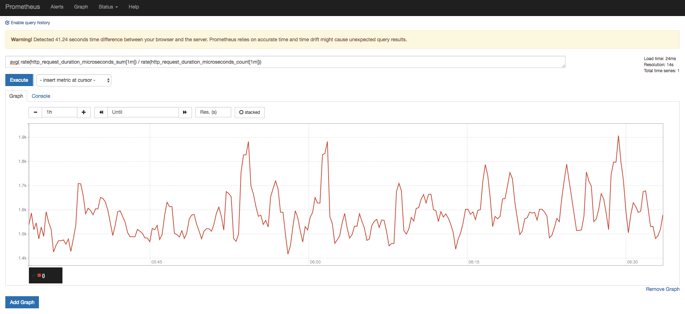

# 服務器（Server）

Prometheus 的核心服務，服務器會按照 `prometheus.yml` 所配置的參數，固定時間抓取目標主機的指標，並且可以設置 `rules_file` 的檔案路徑，透過該檔案設置多筆規則（rule），當主機指標到達規則所設的數值，服務器就會依照配置檔中的 `alerting`，將告警（alert）發送至所配置的 *alertmanager* 位址，使其進行後續的告警通知處理。

## 目錄

- [啟用服務](#啟用服務)
- [數據模型](./data-model.md#數據模型)
- [指標類型](./metric-types.md#指標metrics類型)
    - [收集 Docker 指標](./collect-docker-metrics.md)
- [配置檔](/implement/prometheus/server/)

## 啟用服務

在 `git clone` 該專案後，使用下面指令移動到 `server` 目錄：

```
$ cd ./deploy/prometheus/server
```

使用下面指令，透過 docker 創建運行服務的容器：

```bash
$ docker run --name prometheus \
    -v $(pwd)/prometheus.yml:/etc/prometheus/prometheus.yml \
    -v $(pwd)/config/:/etc/prometheus/config/ \
    -p 9090:9090 \
    -d prom/prometheus
```

透過瀏覽器訪問下面位址，以瀏覽服務器頁面：

```
http://127.0.0.1:9090
```


